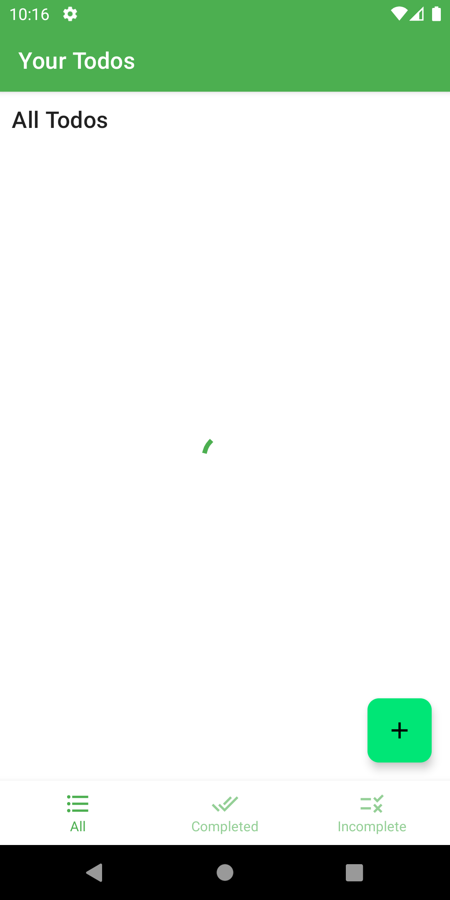

## ✔️Android ToDo App

  This Todo App demonstrates modern Android development with Hilt, Coroutines, Flow, Jetpack (Room,
  ViewModel,Retrofit), and Material Design based on MVVM architecture.

#### 📷 Screenshots

  These are some screenshots of the app 

  
  
  
  

#### 🔺 About

This is a native android app that , helps you to create todos and view them but here comes the interesting part the todos created are persistent they are stored in a sqlite database which acts as a cache and the actual data is stored in a `postgresql` database.

#### :ghost: Backend

The backend is used as a integration for retrofit and okhttp3 , the backend api serves as a primary source of truth for the todo. The tech stack used here :

- [FastApi](https://fastapi.tiangolo.com/)
- [python](https://www.python.org/)
- [heroku-postgresql](https://www.heroku.com/postgres)
- [Heroku](https://id.heroku.com/login)

The backend is hosted at `Heroku` as `fastapi` comes with `swagger` fastapi has created [documentation](https://calm-earth-06277.herokuapp.com/docs) for the api.

#### 📚 Tech stack & Libraries Used

- Minimum SDK level 28
- [Kotlin](https://kotlinlang.org/) based,
- [Coroutines](https://github.com/Kotlin/kotlinx.coroutines)
  - [Flow](https://kotlin.github.io/kotlinx.coroutines/kotlinx-coroutines-core/kotlinx.coroutines.flow/)
    for asynchronous.
- **Jetpack**
  - Lifecycle: Observe Android lifecycles and handle UI states upon the lifecycle changes.
  - ViewModel: Manages UI-related data holder and lifecycle aware. Allows data to survive
    configuration changes such as screen rotations.
  - Room: Constructs Database by providing an abstraction layer over SQLite to allow fluent
    database access.
  - [Hilt](https://dagger.dev/hilt/): for dependency injection.
- **Architecture**
  - MVVM Architecture (View - ViewModel - Model)
- **[Retrofit2 & OkHttp3](https://github.com/square/retrofit)**: Construct the REST APIs and paging
  network data.
- **[Moshi](https://github.com/square/moshi/)**: A modern JSON library for Kotlin and Java.
- **[Material-Components](https://github.com/material-components/material-components-android)**:
  Material design components for building ripple animation, and CardView.

#### 😐Conclusion

Being the first app , It's good 😉
